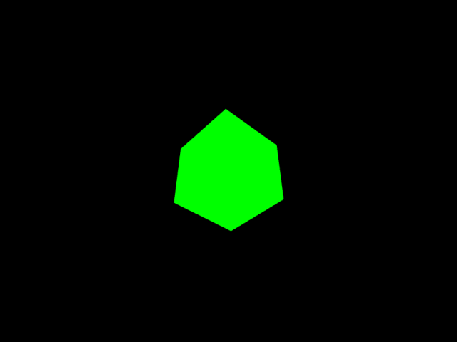
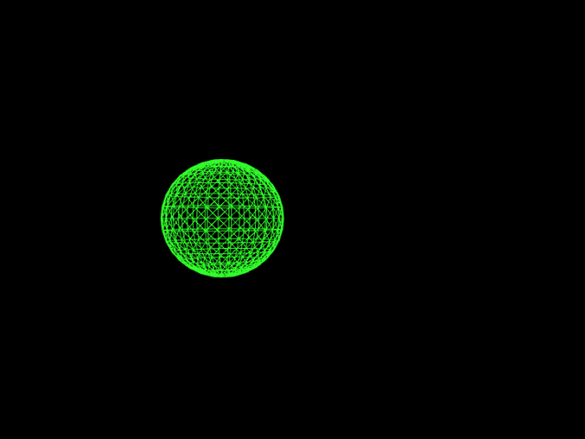
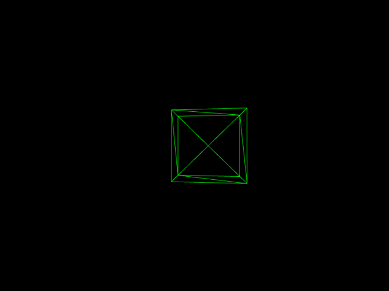
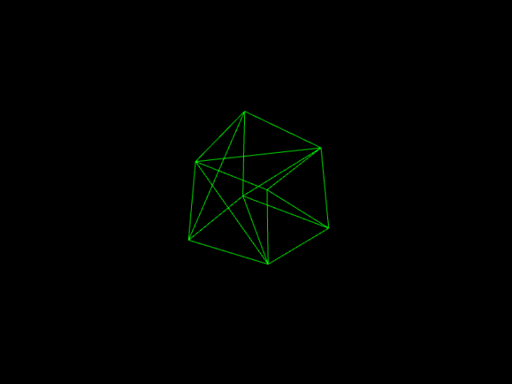
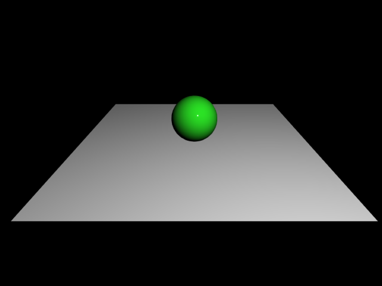
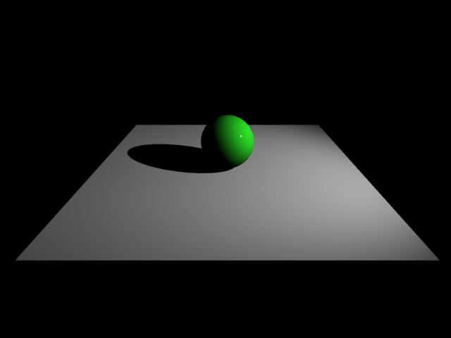
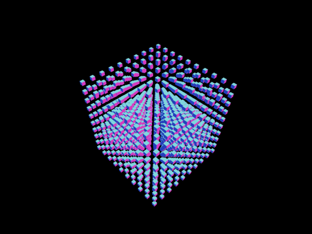
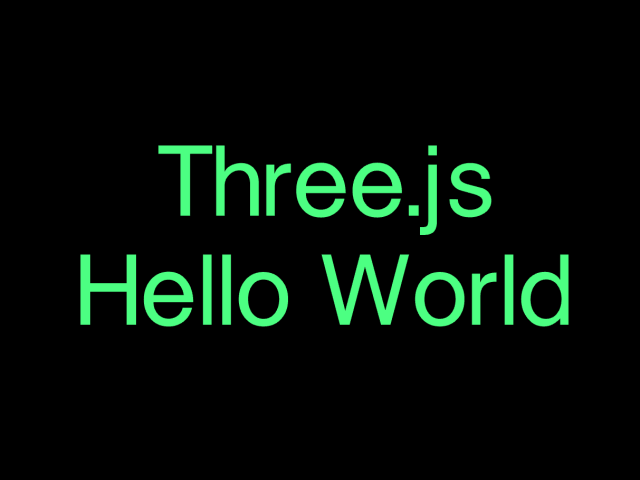
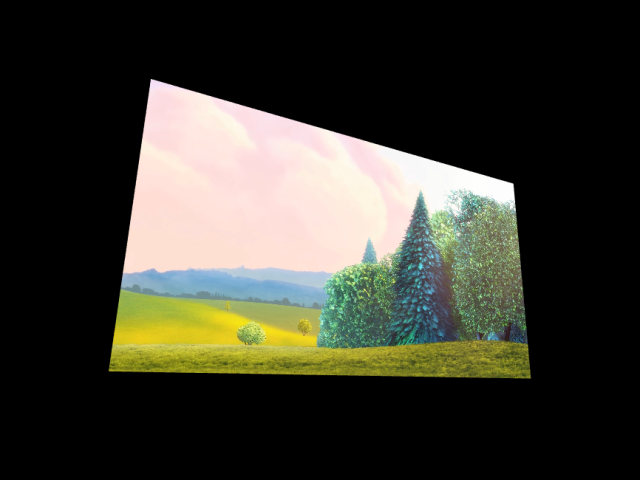

# three.js-project

Simple Web App with Three.js

## Description

Web上でCGを描画できるJavaScriptライブラリ[Three.js](https://threejs.org/)を使用した作品集です。

## Demo

<table style="text-align: center;">
  <tr>
    <td><a href="https://akkunlab.dev/three.js-project/examples/base.html" target="_blank">基礎</a></td>
    <td><a href="https://akkunlab.dev/three.js-project/examples/resize.html" target="_blank">リサイズ</a></td>
    <td><a href="https://akkunlab.dev/three.js-project/examples/audio_global.html" target="_blank">音響</a></td>
  </tr>
  <tr>
    <td><a href="https://akkunlab.dev/three.js-project/examples/audio_positional.html" target="_blank">立体音響</a></td>
    <td><a href="https://akkunlab.dev/three.js-project/examples/controls_first_person.html" target="_blank">First-person Control</a></td>
    <td><a href="https://akkunlab.dev/three.js-project/examples/controls_orbit.html" target="_blank">軌道 Control</a></td>
  </tr>
  <tr>
    <td><a href="https://akkunlab.dev/three.js-project/examples/light_light.html" target="_blank">ライト</a></td>
    <td><a href="https://akkunlab.dev/three.js-project/examples/light_shadow.html" target="_blank">影</a></td>
    <td><a href="https://akkunlab.dev/three.js-project/examples/loader_vrm.html" target="_blank">VRM Loader</a></td>
  </tr>
  <tr>
    <td><a href="https://akkunlab.dev/three.js-project/examples/merge_geometries.html" target="_blank">ジオメトリ結合</a></td>
    <td><a href="https://akkunlab.dev/three.js-project/examples/particles.html" target="_blank">パーティクル</a></td>
    <td><a href="https://akkunlab.dev/three.js-project/examples/shaders_ocean.html" target="_blank">海洋 Shader</a></td>
  </tr>
  <tr>
    <td><a href="https://akkunlab.dev/three.js-project/examples/shape.html" target="_blank">形</a></td>
    <td><a href="https://akkunlab.dev/three.js-project/examples/stars.html" target="_blank">星群</a></td>
    <td><a href="https://akkunlab.dev/three.js-project/examples/text.html" target="_blank">テキスト</a></td>
  </tr>
  <tr>
    <td><a href="https://akkunlab.dev/three.js-project/examples/texture_plane.html" target="_blank">平面 Texture</a></td>
    <td><a href="https://akkunlab.dev/three.js-project/examples/texture_skybox_6sided.html" target="_blank">6面 Skybox</a></td>
    <td><a href="https://akkunlab.dev/three.js-project/examples/texture_skybox_hdr.html" target="_blank">HDR Skybox</a></td>
  </tr>
  <tr>
    <td><a href="https://akkunlab.dev/three.js-project/examples/texture_skybox.html" target="_blank">球面 Skybox</a></td>
    <td><a href="https://akkunlab.dev/three.js-project/examples/texture_video.html" target="_blank">動画 Texture</a></td>
  </tr>
</table>