<div align="center">

# three.js-project

Three.js の機能を 1 デモ 1 ファイルで試せる Web 3D 作例集

[](https://threejs.org/)
[](https://github.com/pixiv/three-vrm)
[](https://lil-gui.georgealways.com/)
[](https://akkunlab.github.io/three.js-project/)


</div>

## 概要

Web 上で 3D CG を描画する JavaScript ライブラリ [Three.js](https://threejs.org/) の作例集です。基本の立方体描画からライト・シャドウ、テクスチャ・スカイボックス、サウンド、VRM モデルの表示まで、機能ごとに 25 本のデモを収録しています。各デモは 1 つの HTML ファイルで完結し、ビルドやバンドラは不要です。

## 特徴

- **1 デモ = 1 ファイル** — `examples/*.html` がそれぞれ自己完結。ライブラリは CDN から読み込むため、`npm install` もビルドも不要
- **VRM 対応** — [three-vrm](https://github.com/pixiv/three-vrm) による VRM モデルの表示、影付き表示、lil-gui で表情（BlendShape）を切り替えるビューア
- **サウンド・動画・スカイボックス** — `Audio` / `PositionalAudio`、`VideoTexture`、3 方式のスカイボックス（パノラマ球・6 面キューブマップ・HDR）を比較できる

## デモ

ライブデモ: [https://akkunlab.github.io/three.js-project/](https://akkunlab.github.io/three.js-project/)

サムネイルをクリックすると各デモが開きます。

<table>
  <tr>
    <td align="center"><a href="https://akkunlab.github.io/three.js-project/examples/base.html">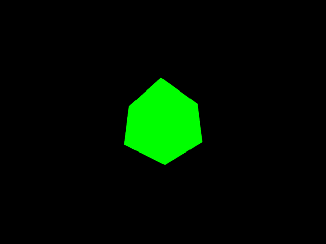<br>Base</a></td>
    <td align="center"><a href="https://akkunlab.github.io/three.js-project/examples/resize.html"><br>Resize</a></td>
    <td align="center"><a href="https://akkunlab.github.io/three.js-project/examples/gui.html">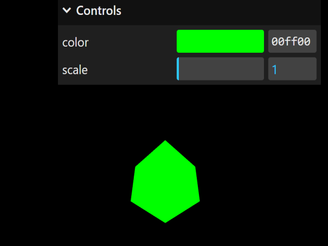<br>GUI</a></td>
  </tr>
  <tr>
    <td align="center"><a href="https://akkunlab.github.io/three.js-project/examples/shape.html"><br>Shape</a></td>
    <td align="center"><a href="https://akkunlab.github.io/three.js-project/examples/merge_geometries.html">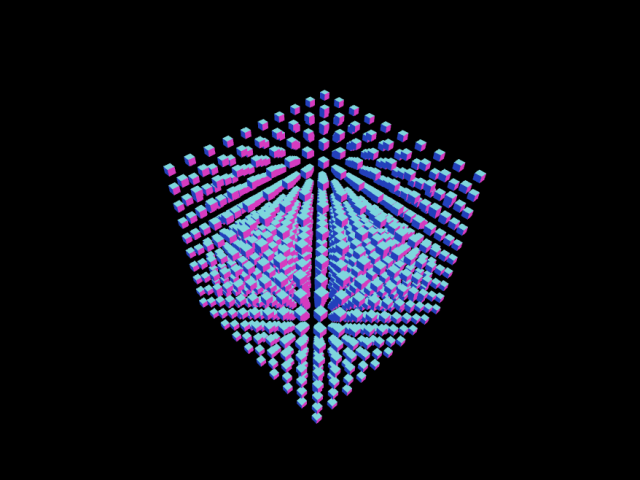<br>Merge Geometries</a></td>
    <td align="center"><a href="https://akkunlab.github.io/three.js-project/examples/rainbow_box.html">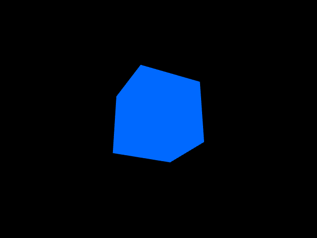<br>Rainbow Box</a></td>
  </tr>
  <tr>
    <td align="center"><a href="https://akkunlab.github.io/three.js-project/examples/light_light.html">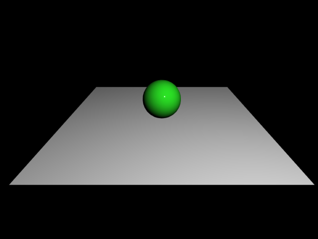<br>Light</a></td>
    <td align="center"><a href="https://akkunlab.github.io/three.js-project/examples/light_shadow.html">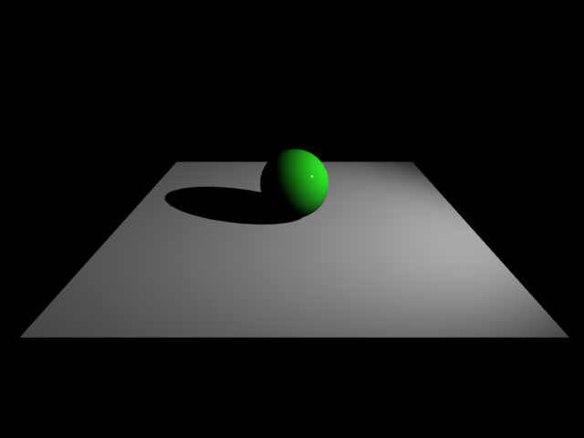<br>Shadow</a></td>
    <td align="center"><a href="https://akkunlab.github.io/three.js-project/examples/particles.html"><br>Particles</a></td>
  </tr>
  <tr>
    <td align="center"><a href="https://akkunlab.github.io/three.js-project/examples/stars.html"><br>Stars</a></td>
    <td align="center"><a href="https://akkunlab.github.io/three.js-project/examples/text.html">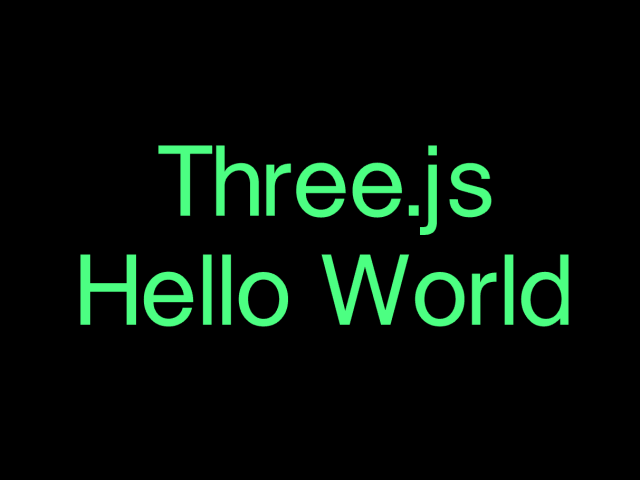<br>Text</a></td>
    <td align="center"><a href="https://akkunlab.github.io/three.js-project/examples/controls_orbit.html">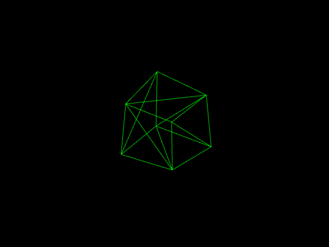<br>Orbit Controls</a></td>
  </tr>
  <tr>
    <td align="center"><a href="https://akkunlab.github.io/three.js-project/examples/controls_first_person.html">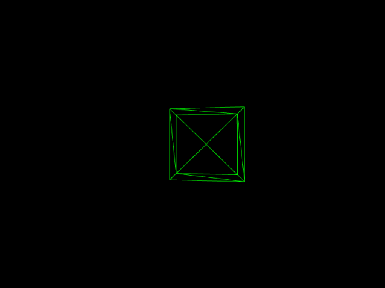<br>First-person Controls</a></td>
    <td align="center"><a href="https://akkunlab.github.io/three.js-project/examples/texture_plane.html"><br>Plane Texture</a></td>
    <td align="center"><a href="https://akkunlab.github.io/three.js-project/examples/texture_video.html">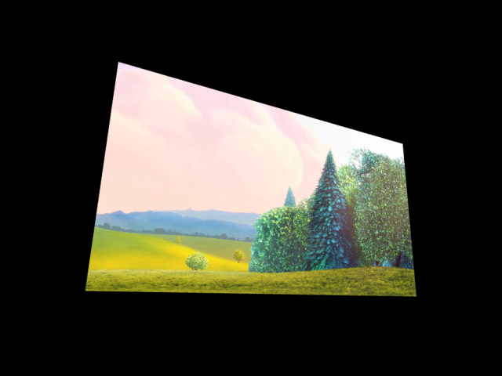<br>Video Texture</a></td>
  </tr>
  <tr>
    <td align="center"><a href="https://akkunlab.github.io/three.js-project/examples/texture_skybox.html"><br>Skybox</a></td>
    <td align="center"><a href="https://akkunlab.github.io/three.js-project/examples/texture_skybox_6sided.html"><br>6-sided Skybox</a></td>
    <td align="center"><a href="https://akkunlab.github.io/three.js-project/examples/texture_skybox_hdr.html"><br>HDR Skybox</a></td>
  </tr>
  <tr>
    <td align="center"><a href="https://akkunlab.github.io/three.js-project/examples/shaders_ocean.html"><br>Ocean Shader</a></td>
    <td align="center"><a href="https://akkunlab.github.io/three.js-project/examples/audio_global.html">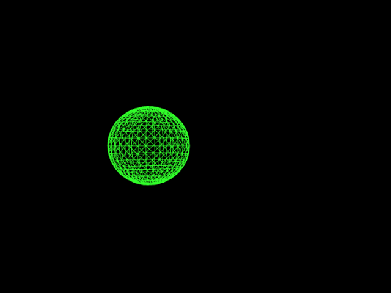<br>Audio</a></td>
    <td align="center"><a href="https://akkunlab.github.io/three.js-project/examples/audio_positional.html"><br>Positional Audio</a></td>
  </tr>
  <tr>
    <td align="center"><a href="https://akkunlab.github.io/three.js-project/examples/loader_vrm.html">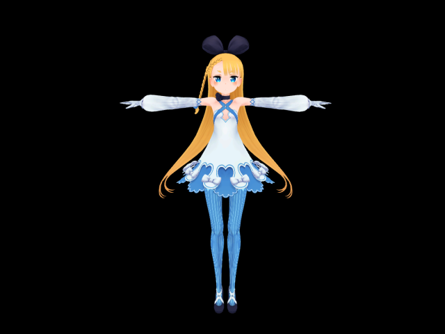<br>VRM Loader</a></td>
    <td align="center"><a href="https://akkunlab.github.io/three.js-project/examples/loader_three-vrm.html">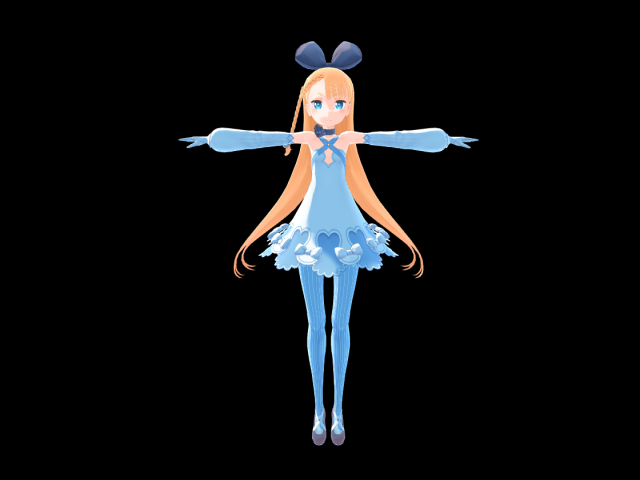<br>three-vrm</a></td>
    <td align="center"><a href="https://akkunlab.github.io/three.js-project/examples/loader_three-vrm_shadow.html">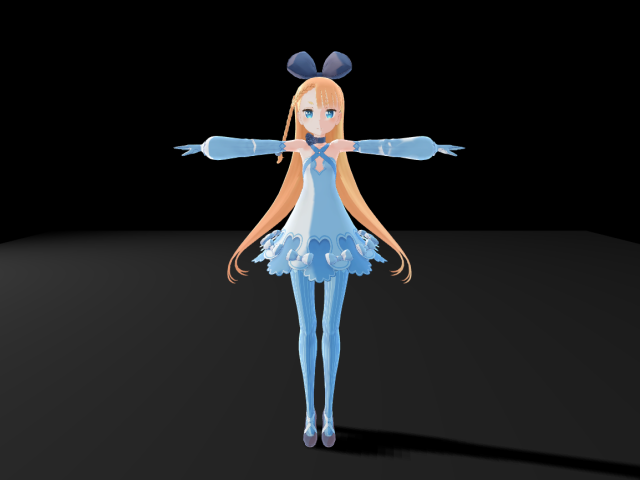<br>three-vrm Shadow</a></td>
  </tr>
  <tr>
    <td align="center"><a href="https://akkunlab.github.io/three.js-project/examples/loader_three-vrm_viewer.html">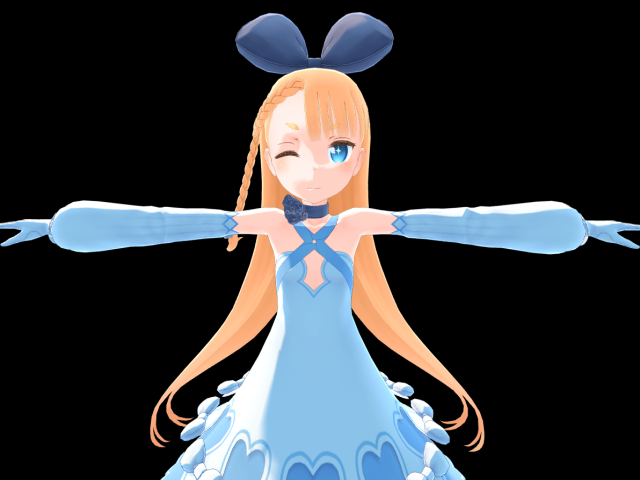<br>three-vrm Viewer</a></td>
    <td></td>
    <td></td>
  </tr>
</table>

- Audio / Positional Audio / Video Texture は、ブラウザの自動再生制限のため画面中央の **Play** ボタンを押すと開始します
- VRM Loader は Three.js 本体の旧 `VRMLoader`（r138 で削除済み）を使うため現在は動作しません。VRM 表示は three-vrm 系のデモを参照してください

## 技術スタック

| 領域 | 技術 |
| --- | --- |
| 3D | [Three.js](https://threejs.org/) r147（three-vrm 系は r141）。ES Modules + Import Maps で CDN から読み込み |
| VRM | [@pixiv/three-vrm](https://github.com/pixiv/three-vrm) 0.6.11 |
| GUI / polyfill | [lil-gui](https://lil-gui.georgealways.com/) 0.16 / es-module-shims 1.3.6 |

## セットアップ

ライブラリは CDN から取得するためインストールは不要です。ES Modules は `file://` では動かないので、静的サーバーを経由して開きます。

```bash
git clone https://github.com/Akkunlab/three.js-project.git
cd three.js-project
python3 -m http.server 8000
```

`http://localhost:8000/examples/base.html` のように `examples/` 配下の HTML を開きます。

## 構成

```text
examples/             各デモ（1 HTML = 1 デモ）
  assets/css/         共通スタイル（余白リセット、Play ボタン）
  assets/models/      VRM モデル
  assets/ogg/         BGM
  assets/textures/    テクスチャ・スカイボックス画像・HDR
  assets/videos/      動画テクスチャ用の MP4
images/               README 用サムネイル（examples_<デモ名>.png）
```

## 使用素材

- 3D モデル: [アリシア・ソリッド](https://3d.nicovideo.jp/alicia/)
- BGM: [弥生の空に](https://amachamusic.chagasi.com/music_yayoinosorani.html)（甘茶の音楽工房）
- 動画: [Big Buck Bunny](https://peach.blender.org/)
- スカイボックス: [Fantasy Skybox FREE](https://assetstore.unity.com/packages/2d/textures-materials/sky/fantasy-skybox-free-18353) / [AllSky Free](https://assetstore.unity.com/packages/2d/textures-materials/sky/allsky-free-10-sky-skybox-set-146014) / [Skybox Series Free](https://assetstore.unity.com/packages/2d/textures-materials/sky/skybox-series-free-103633) / [aosystem SKYBOX](https://ao-system.net/skybox/)
