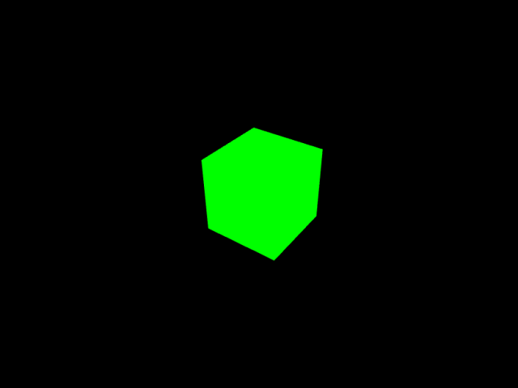
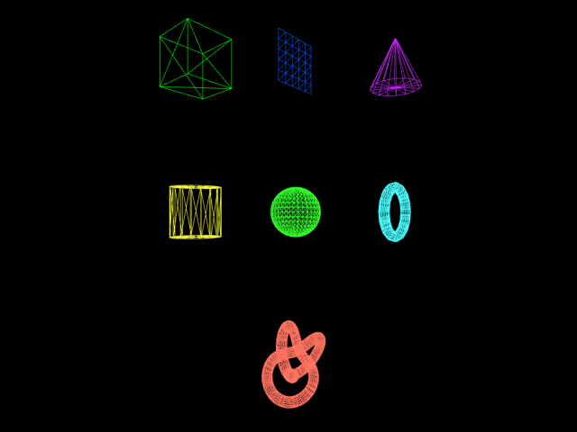
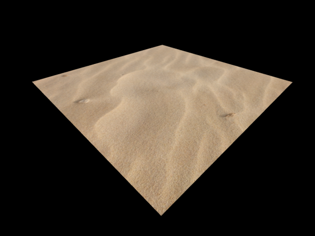

# three.js-project

Simple Web App with Three.js

## Description

Web上でCGを描画できるJavaScriptライブラリ[Three.js](https://threejs.org/)を使用した作品集です。

## Demo

<table>
  <tr>
    <td><a href="https://akkunlab.dev/three.js-project/examples/base.html">基礎</a></td>
    <td><a href="https://akkunlab.dev/three.js-project/examples/resize.html">リサイズ</a></td>
    <td><a href="https://akkunlab.dev/three.js-project/examples/audio_global.html">音響</a></td>
  </tr>
  <tr>
    <td><a href="https://akkunlab.dev/three.js-project/examples/audio_positional.html">立体音響</a></td>
    <td><a href="https://akkunlab.dev/three.js-project/examples/controls_first_person.html">First-person Control</a></td>
    <td><a href="https://akkunlab.dev/three.js-project/examples/controls_orbit.html">軌道 Control</a></td>
  </tr>
  <tr>
    <td><a href="https://akkunlab.dev/three.js-project/examples/rainbow_box.html">虹色 Box</a></td>
    <td><a href="https://akkunlab.dev/three.js-project/examples/light_light.html">ライト</a></td>
    <td><a href="https://akkunlab.dev/three.js-project/examples/light_shadow.html">影</a></td>
  </tr>
  <tr>
    <td><a href="https://akkunlab.dev/three.js-project/examples/loader_vrm.html">VRM Loader</a></td>
    <td><a href="https://akkunlab.dev/three.js-project/examples/merge_geometries.html">ジオメトリ結合</a></td>
    <td><a href="https://akkunlab.dev/three.js-project/examples/particles.html">パーティクル</a></td>
  </tr>
  <tr>
    <td><a href="https://akkunlab.dev/three.js-project/examples/shaders_ocean.html">海洋 Shader</a></td>
    <td><a href="https://akkunlab.dev/three.js-project/examples/shape.html">形</a></td>
    <td><a href="https://akkunlab.dev/three.js-project/examples/stars.html">星群</a></td>
  </tr>
  <tr>
    <td><a href="https://akkunlab.dev/three.js-project/examples/text.html">テキスト</a></td>
    <td><a href="https://akkunlab.dev/three.js-project/examples/texture_plane.html">平面 Texture</a></td>
    <td><a href="https://akkunlab.dev/three.js-project/examples/texture_skybox_6sided.html">6面 Skybox</a></td>
  </tr>
  <tr>
    <td><a href="https://akkunlab.dev/three.js-project/examples/texture_skybox.html">球面 Skybox</a></td>
    <td><a href="https://akkunlab.dev/three.js-project/examples/texture_video.html">動画 Texture</a></td>
    <td><a href="https://akkunlab.dev/three.js-project/examples/texture_skybox_hdr.html">HDR Skybox</a></td>
  </tr>
</table>