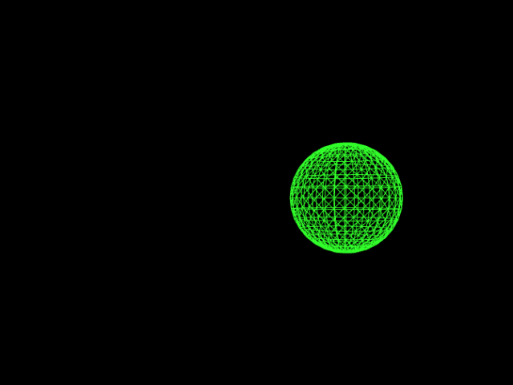
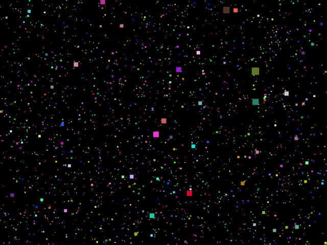

# three.js-project

Simple Web App with Three.js

## Description

Web上でCGを描画できるJavaScriptライブラリ[Three.js](https://threejs.org/)を使用した作品集です。

## Demo

<table>
  <tr>
    <td><a href="https://akkunlab.dev/three.js-project/examples/base.html">Base</a></td>
    <td><a href="https://akkunlab.dev/three.js-project/examples/resize.html">Resize</a></td>
    <td><a href="https://akkunlab.dev/three.js-project/examples/gui.html">GUI</a></td>
  </tr>
  <tr>
    <td><a href="https://akkunlab.dev/three.js-project/examples/audio_global.html">Audio</a></td>
    <td><a href="https://akkunlab.dev/three.js-project/examples/audio_positional.html">Positional Audio</a></td>
    <td><a href="https://akkunlab.dev/three.js-project/examples/controls_first_person.html">First-person Control</a></td>
  </tr>
  <tr>
    <td><a href="https://akkunlab.dev/three.js-project/examples/controls_orbit.html">Orbit Control</a></td>
    <td><a href="https://akkunlab.dev/three.js-project/examples/rainbow_box.html">Rainbow Box</a></td>
    <td><a href="https://akkunlab.dev/three.js-project/examples/light_light.html">Light</a></td>
  </tr>
  <tr>
    <td><a href="https://akkunlab.dev/three.js-project/examples/light_shadow.html">Shadow</a></td>
    <td><a href="https://akkunlab.dev/three.js-project/examples/merge_geometries.html">Merge Geometries</a></td>
    <td><a href="https://akkunlab.dev/three.js-project/examples/particles.html">Particles</a></td>
  </tr>
  <tr>
    <td><a href="https://akkunlab.dev/three.js-project/examples/loader_vrm.html">VRM Loader</a></td>
    <td><a href="https://akkunlab.dev/three.js-project/examples/loader_three-vrm.html">three-vrm</a></td>
    <td><a href="https://akkunlab.dev/three.js-project/examples/loader_three-vrm_shadow.html">three-vrm Shadow</a></td>
  </tr>
  <tr>
    <td><a href="https://akkunlab.dev/three.js-project/examples/loader_three-vrm_viewer.html">three-vrm Viewer</a></td>
    <td><a href="https://akkunlab.dev/three.js-project/examples/shaders_ocean.html">Ocean Shader</a></td>
    <td><a href="https://akkunlab.dev/three.js-project/examples/shape.html">Shape</a></td>
  </tr>
  <tr>
    <td><a href="https://akkunlab.dev/three.js-project/examples/stars.html">Stars</a></td>
    <td><a href="https://akkunlab.dev/three.js-project/examples/text.html">Text</a></td>
    <td><a href="https://akkunlab.dev/three.js-project/examples/texture_plane.html">Plane Texture</a></td>
  </tr>
  <tr>
    <td><a href="https://akkunlab.dev/three.js-project/examples/texture_skybox_6sided.html">6sided Skybox</a></td>
    <td><a href="https://akkunlab.dev/three.js-project/examples/texture_skybox.html">Skybox</a></td>
    <td><a href="https://akkunlab.dev/three.js-project/examples/texture_video.html">Video Texture</a></td>
  </tr>
  <tr>
    <td><a href="https://akkunlab.dev/three.js-project/examples/texture_skybox_hdr.html">HDR Skybox</a></td>
  </tr>
</table>
