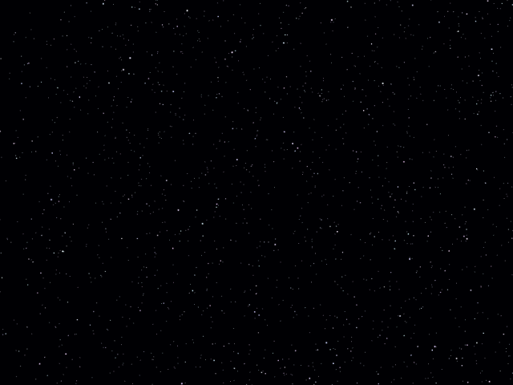

# three.js-project
Simple Web App with Three.js

## Description
Web上でCGを描画できるJavaScriptライブラリ[Three.js](https://threejs.org/)を使用した作品集です。

## Demo

<table style="text-align: center;">
  <tr>
    <td><a href="images/examples_base.png" target="_blank">基礎</a></td>
    <td><a href="images/examples_resize.png" target="_blank">リサイズ</a></td>
    <td><a href="images/examples_audio_global.png" target="_blank">音響</a></td>
  </tr>
  <tr>
    <td><a href="images/examples_audio_positional.png" target="_blank">立体音響</a></td>
    <td><a href="images/examples_controls_first_person.png" target="_blank">First-person Control</a></td>
    <td><a href="images/examples_controls_orbit.png" target="_blank">軌道 Control</a></td>
  </tr>
  <tr>
    <td><a href="images/examples_light_light.png" target="_blank">ライト</a></td>
    <td><a href="images/examples_light_shadow.png" target="_blank">影</a></td>
    <td><a href="images/examples_loader_vrm.png" target="_blank">VRM Loader</a></td>
  </tr>
  <tr>
    <td><a href="images/examples_merge_geometries.png" target="_blank">ジオメトリ結合</a></td>
    <td><a href="images/examples_particles.png" target="_blank">パーティクル</a></td>
    <td><a href="images/examples_shaders_ocean.png" target="_blank">海洋 Shader</a></td>
  </tr>
  <tr>
    <td><a href="images/examples_shape.png" target="_blank">形</a></td>
    <td><a href="images/examples_stars.png" target="_blank">星群</a></td>
    <td><a href="images/examples_text.png" target="_blank">テキスト</a></td>
  </tr>
  <tr>
    <td><a href="images/examples_texture_plane.png" target="_blank">平面 Texture</a></td>
    <td><a href="images/examples_texture_skybox_6sided.png" target="_blank">6面 Skybox</a></td>
    <td><a href="images/examples_texture_skybox_hdr.png" target="_blank">HDR Skybox</a></td>
  </tr>
  <tr>
    <td><a href="images/examples_texture_skybox.png" target="_blank">球面 Skybox</a></td>
    <td><a href="images/examples_texture_video.png" target="_blank">動画 Texture</a></td>
  </tr>
</table>